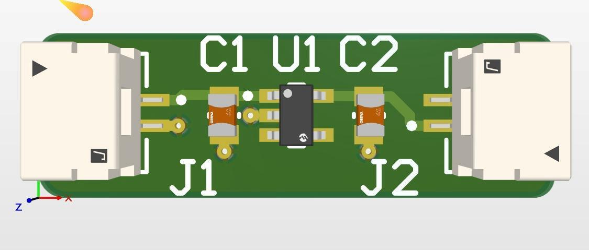
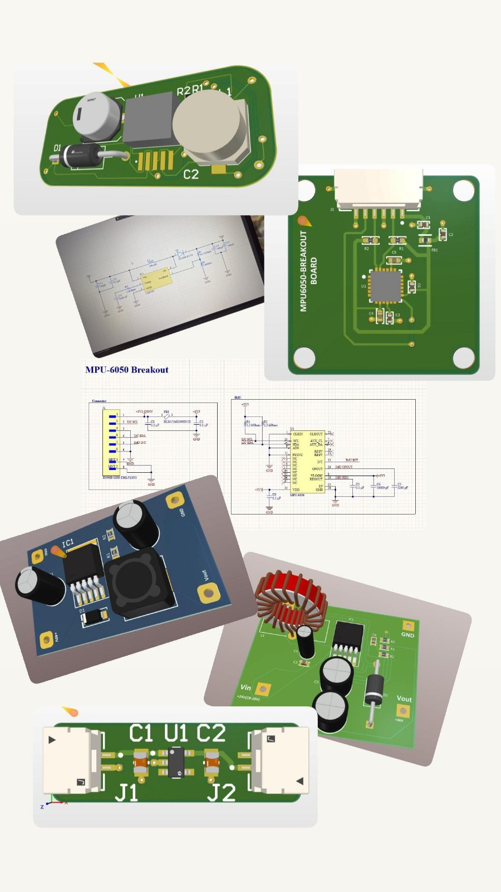
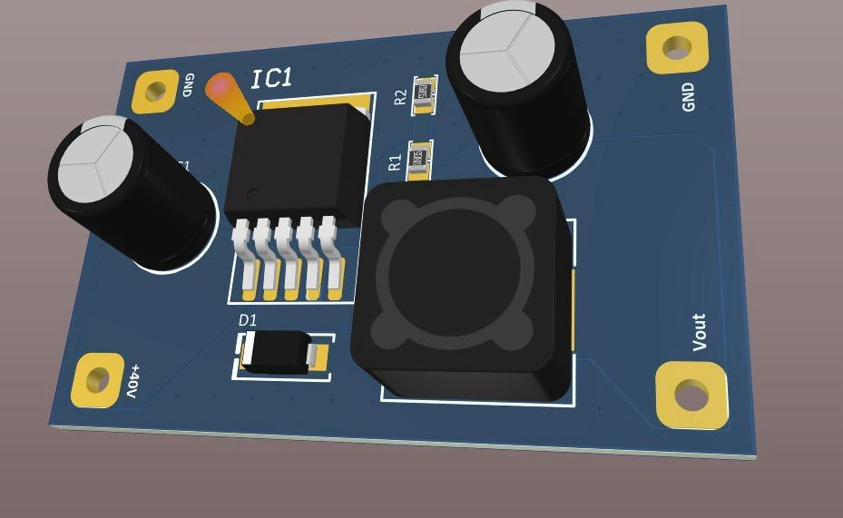
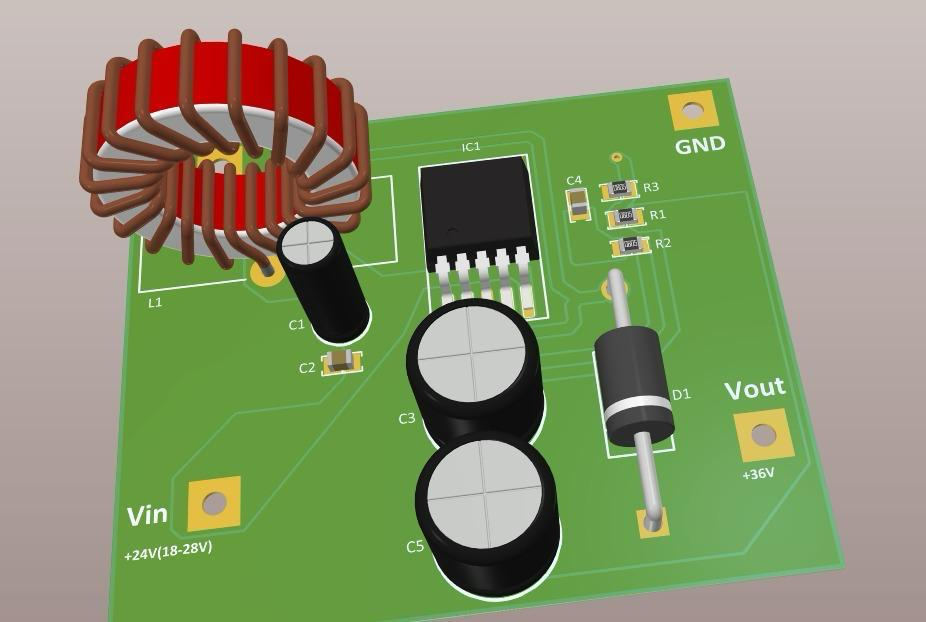
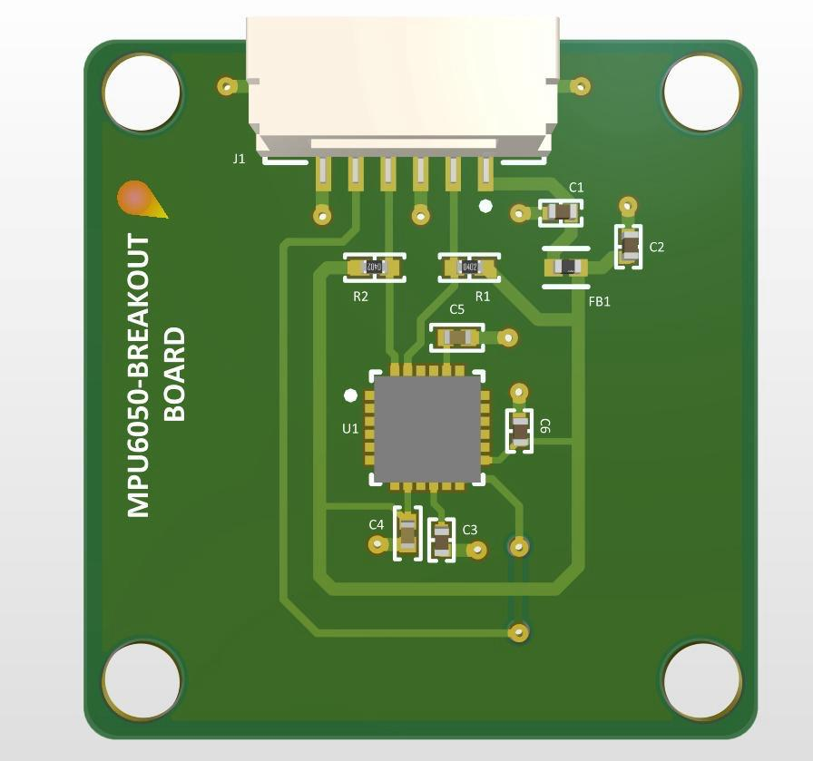

# Temel PCB Devre Tasarımları

Bu klasör, temel PCB tasarım prensiplerini uygulamalı olarak geliştirmek amacıyla hazırlanmış küçük ölçekli PCB projelerini içermektedir.

## Odaklanılan Alanlar

- Bileşen konumlandırma stratejileri
- Sinyal yönlendirme teknikleri
- Güç ve toprak düzlemi yerleşimi
- PCB tasarım kurallarının anlaşılması
- Altium Designer ile uygulamalı tasarım becerilerinin geliştirilmesi

## Kullanılan Araçlar

- Altium Designer

## Görseller

