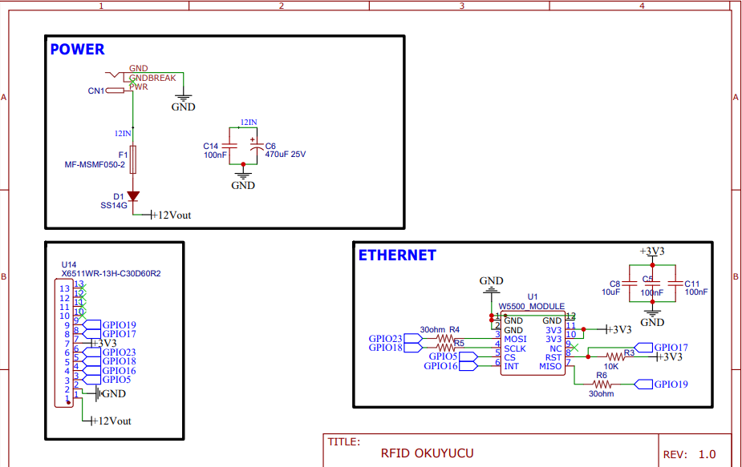
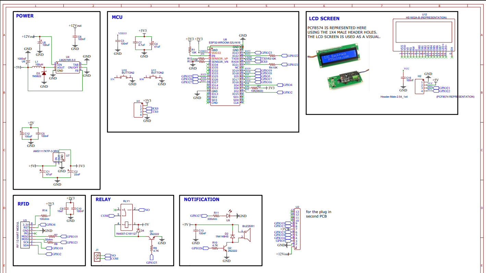
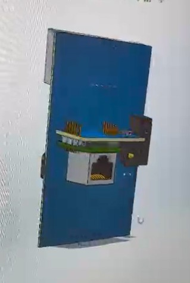

# ESP32 Tabanlı RFID Kontrol Sistemi

Bu proje, ESP32 tabanlı bir RFID kontrol sistemi tasarımını içermektedir. Sistem; RFID kart okuma, kullanıcı bilgilendirme, röle kontrolü ve ekran üzerinden durum gösterimi işlevlerini tek bir donanım yapısı üzerinde birleştirmek amacıyla geliştirilmiştir.

Proje kapsamında güç yönetimi, mikrodenetleyici bağlantıları, RFID haberleşmesi, LCD ekran entegrasyonu, röle sürme devresi ve sesli/görsel bildirim yapısı birlikte ele alınmıştır.

## Proje Özeti

Bu tasarım, RFID kart veya etiket okutulduğunda ilgili bilgiyi işleyebilen, kullanıcıya ekran ve bildirim elemanları üzerinden geri dönüş verebilen ve gerekli durumda röle çıkışı ile harici bir yükü kontrol edebilen gömülü bir sistem altyapısı sunmaktadır.

Sistem, özellikle erişim kontrolü, yetkilendirme, akıllı kilit, kartlı geçiş veya benzeri otomasyon uygulamalarına uygun bir donanım yapısı oluşturmak amacıyla hazırlanmıştır.

## Sistem Bileşenleri

Projede yer alan temel bloklar aşağıdaki gibidir:

- **Güç Katı**
  - 12V giriş
  - 5V regülasyon
  - 3.3V regülasyon
  - Filtreleme ve bypass kapasitörleri

- **Mikrodenetleyici Katı**
  - ESP32-WROOM-32 modülü
  - UART başlığı
  - Boot ve enable butonları
  - Gerekli pull-up / pull-down bağlantıları

- **RFID Arabirimi**
  - RFID modülü bağlantısı
  - SPI haberleşme hatları
  - 3.3V besleme altyapısı

- **LCD Ekran Arabirimi**
  - I2C haberleşmeli LCD yapı
  - PCF8574 tabanlı arayüz temsili
  - Kullanıcıya metin tabanlı bilgi gösterimi

- **Röle Sürme Devresi**
  - Röle kontrol çıkışı
  - NPN transistör ile sürme yapısı
  - Koruma diyodu
  - Harici yük anahtarlama altyapısı

- **Bildirim Katı**
  - Buzzer sürme devresi
  - LED uyarı çıkışı
  - Görsel ve sesli geri bildirim

## Projenin Amacı

Bu projenin temel amacı, aşağıdaki konularda uygulamalı deneyim kazanmaktır:

- ESP32 tabanlı donanım tasarımı
- RFID modülü entegrasyonu
- Güç katı tasarımı
- Röle sürme devresi oluşturma
- I2C tabanlı LCD ekran bağlantısı
- Uyarı ve bildirim devrelerinin tasarlanması
- Çok bloklu gömülü sistem mimarisinin oluşturulması

## Kullanılan Teknolojiler ve Bileşenler

- ESP32-WROOM-32
- RFID okuyucu modülü
- I2C LCD ekran altyapısı
- Röle
- 2N2222 transistör
- Buzzer
- LED bildirim devresi
- 5V ve 3.3V regülatör yapıları
- Şematik ve PCB tasarım araçları

## Teknik İçerik

Bu proje kapsamında aşağıdaki teknik başlıklara odaklanılmıştır:

- 12V girişten çoklu besleme hattı oluşturulması
- ESP32 için uygun besleme ve çevresel bağlantıların tasarlanması
- RFID haberleşme hatlarının mikrodenetleyiciye bağlanması
- I2C ekran arayüzünün sisteme entegre edilmesi
- Röle sürme devresinde transistör ve koruma diyodu kullanımı
- Buzzer ve LED ile kullanıcı bildirim altyapısı oluşturulması
- Modüler blok yapıda şematik organizasyonu

## Uygulama Alanları

Bu tasarım aşağıdaki sistemlerde kullanılabilecek altyapıya sahiptir:

- Kartlı geçiş sistemleri
- Akıllı kilit sistemleri
- Yetkilendirme ve erişim kontrol uygulamaları
- Gömülü otomasyon sistemleri
- RFID tabanlı kullanıcı doğrulama projeleri

## Proje Görselleri

## Geliştirme Potansiyeli

Proje aşağıdaki yönlerden geliştirilebilir:

- PCB tasarımının tamamlanması ve üretime hazırlanması
- Harici muhafaza tasarımı
- Yetkili / yetkisiz kart veritabanı yapısının eklenmesi
- Wi-Fi veya Bluetooth tabanlı uzaktan yönetim
- Log kaydı tutma
- Kapı kilidi veya manyetik kilit entegrasyonu
- Gerçek zaman saati (RTC) eklenmesi
- Mobil uygulama veya web arayüzü ile kontrol

## Sonuç

Bu proje, RFID tabanlı kontrol sistemleri için gerekli temel donanım bloklarını bir araya getiren, modüler yapıda geliştirilmiş bir gömülü sistem tasarımıdır. Güç elektroniği, mikrodenetleyici bağlantıları, haberleşme arayüzleri, kullanıcı bildirim elemanları ve röle kontrolü gibi farklı alt sistemleri tek bir yapı içinde birleştirmesi açısından kapsamlı bir uygulama çalışmasıdır.
